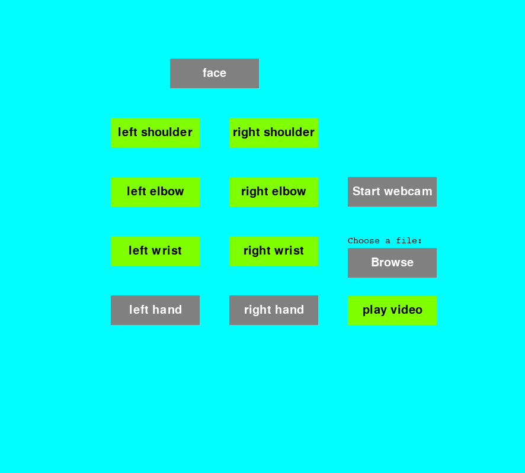
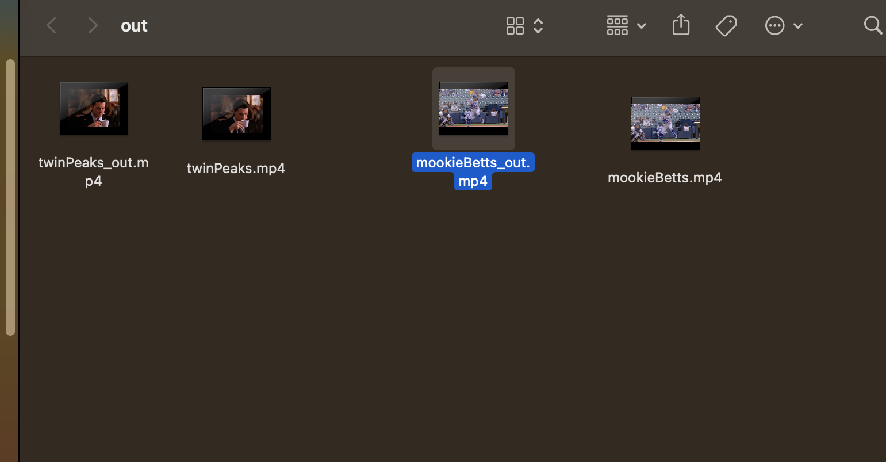
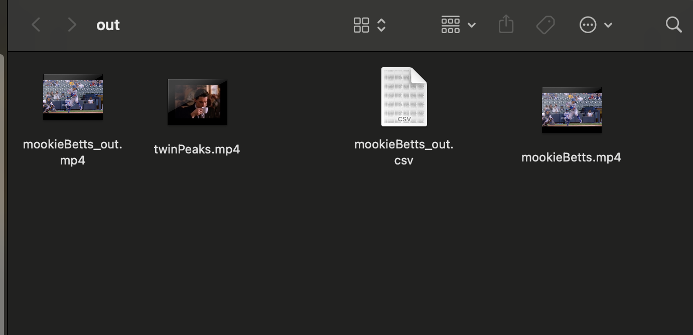

## Pose Estimation model: https://google.github.io/mediapipe/solutions/pose.html

# Usage

# Landmark and video selection menu screen
This screen allows the user to select the landmarks they are interested in tracking and this is indicated by the button turning green. The browse button lets the user chose a video from their file system. If the video is the correct format, then the "play video" button turns green as well. Clicking play shows the video with the selected landmarks and then outputs a csv file and a video copy with the selected landmarks

# Setup
- MacOS (intel chip)
  - use pip to install the following:
    - pygame
    - opencv-python
    - mediapipe
    - tkinter
    - numpy

- to install mediapipe for raspberryPi see this quick start guide: https://github.com/robo27918/Senior-Project-Mobility-Scooter-ML/blob/main/MediepipeSetup.md
